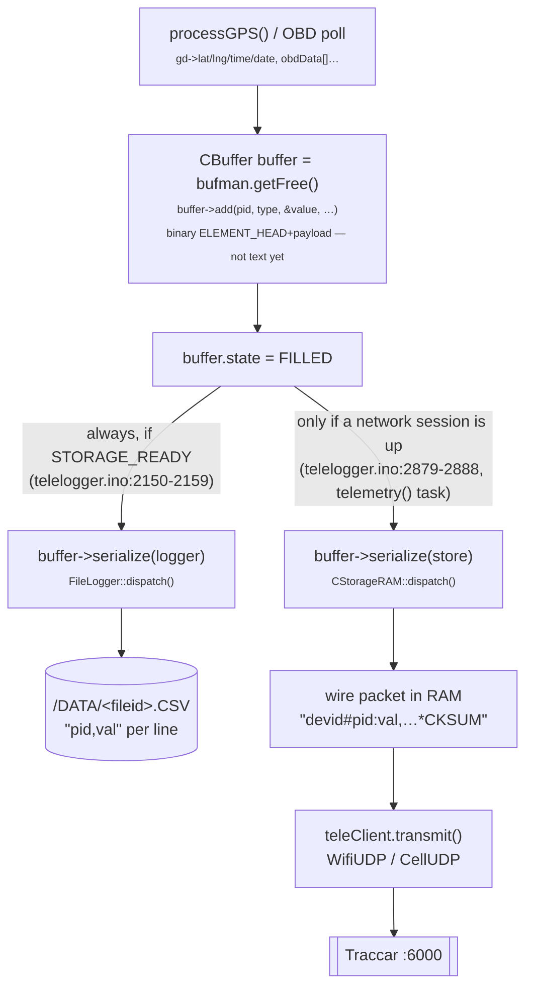
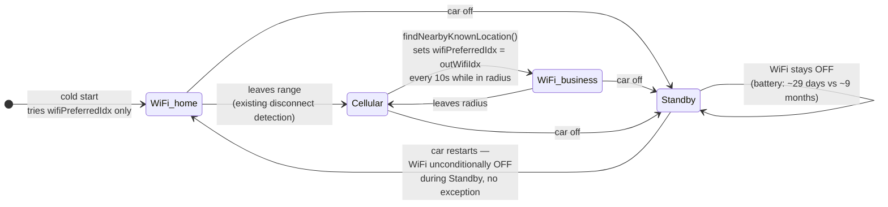

# Freematics telelogger — firmware architecture

`firmware_v5/telelogger/` (ESP32, Freematics ONE+, VW Passat B8). Part A is
the full firmware — every subsystem, not just the ones touched this
session. Part B is the detailed GPS/buffer/network/SD data path (this
session's actual debugging focus) and the WiFi/geofence design. Written
2026-09-22, verified against the actual code — see file:line references
throughout. Companion doc: `traccar` repo's `ARCHITECTURE_FREEMATICS.md`.

## Part A — the whole firmware

### A1. Every top-level function (`telelogger.ino`, declaration order)

```
setup() → loop()                         Arduino entry points

initialize()          full (re-)init: sys.begin(), obd.init(), GPS begin,
                       MEMS, bufman.init(), logger.init()+begin(), NVS load
loadConfig()           NVS → every runtime-configurable global
process()              ONE sample cycle: OBD → GPS → MEMS → ext inputs →
                        fills a CBuffer slot (runs from loop(), main core)
standby()              car-off power state — SD close, GPS off, WiFi off
                        (unconditional), deep-sleep OR JUMPSTART_VOLTAGE
                        polling loop until the car restarts
telemetry(void*)       FreeRTOS task — owns WiFi/cellular, drains CBuffers,
                        writes the SD log, runs catchUpMissedFiles()

processOBD(buffer)      tiered Mode-1 PID polling (A2)
processGPS(buffer)      GPS fix → buffer (Part B §2)
processMEMS(buffer)     accelerometer/gyro → buffer (calibrateMEMS() once)
processBLE(timeout)     NimBLE SPP-like service (A3)
processExtInputs(buffer) digital/analog aux inputs on spare GPIOs

wifiConnect() / wifiReconnectCurrent()   Part B §6
syncKnownLocations() / findNearbyKnownLocation()   Part B §8

initGPS() / initCell(quick)              per-subsystem bring-up
performPullOtaCheck() / performPullOtaFlash()   pull-OTA (A5)
catchUpMissedFiles() / sendCsvFile()     Part B §5

handlerLiveData(param)  dataserver.cpp-style handler defined in the .ino
                        (serves /api/live — see A4 for the rest)
showStats() / showSysInfo() / printTime() / printTimeoutStats() / printOtaStatus()
                        Serial diagnostics only
genDeviceID(buf)        derives the device's short ID from efuse MAC
```

### A2. OBD polling (`processOBD()`, `telelogger.ino:1235`)

```
obdData[]   compile-time table of standard Mode-1 PIDs, each tagged with a
            tier (1/2/3) — tier 1 polled every process() cycle, tier 2/3
            polled less often via a rotating per-tier index (idx[]), so a
            slow/rarely-needed PID doesn't steal cycles from RPM/speed.
  → buffer->add((pid | 0x100), ELEMENT_INT32, &value, …)   // 0x100 offset
    distinguishes "standard OBD PID N" from this firmware's own PID space

vehicleObdData[]   NVS-configured EXTRA PIDs (VEHICLE_PIDS key) — vehicle-
            specific reads (e.g. this project's VAG UDS odometer/fuel block
            lives elsewhere, see initialize()/loadConfig() for the UDS
            session setup) — polled one per call via a separate rotating
            index, independent of the standard-PID tier system above.

obd.errors >= MAX_OBD_ERRORS → obd.init() retried; failing that,
STATE_OBD_READY clears and process() returns early for that cycle (OBD
absent doesn't stall GPS/MEMS/network — each subsystem's readiness is its
own flag, checked independently in process()).
```

### A3. BLE (`processBLE()`, NimBLE backend)

A SPP-like GATT service (`ble_spp_server_nimble.cpp`) for local
configuration/diagnostics over Bluetooth, independent of WiFi/cellular.
**WiFi/BT coexistence**: `ble_pause()`/`ble_resume()` wrap every WiFi
(re)connect attempt — `WiFi.setSleep(false)` is rejected by the ESP32's
radio-coexistence layer while BLE is active, so BLE is paused for the
duration of a WiFi join handshake and resumed after (`WiFi.setSleep(true)`
called first, matching the same ordering used everywhere this pattern
appears — see `ClientWIFI::begin()`'s own comment in `FreematicsNetwork.cpp`).

### A4. Local HTTPD (`dataserver.cpp`, port 80)

| Path | Handler | Purpose |
|---|---|---|
| `/api/live` | `handlerLiveData` (in `telelogger.ino`) | current sensor snapshot as JSON |
| `/api/info` | `handlerInfo` | device ID, firmware build, uptime, … |
| `/api/control` | `handlerControl` | `?cmd=KEY=value` — the general runtime-config write path (SSID=, WPWD=, OTA_TOKEN=, OTA_PORT=, WM_FILE=, RESET, ON/OFF, …) |
| `/api/ota` | `handlerOTA` | local (LAN-side) firmware upload, separate from pull-OTA (A5) |
| `/api/list` | `handlerLogList` | list `/DATA/*.CSV` file ids + sizes |
| `/api/data` | `handlerLogData` | query a log file's samples by PID |
| `/api/log` | `handlerLogFile` | raw file download/stream |
| `/api/events` | `handlerLogEvents` | just the `FE,` diagnostic lines from a log file |
| `/api/delete` | `handlerLogDelete` | `DELETE /api/delete/<id>` — remove one `/DATA/<id>.CSV` (refuses the currently-active file) |

Also the fallback softAP config portal (`TELELOGGER`/`PASSWORD`,
`192.168.4.1`) — works independent of `ENABLE_WIFI`'s station-mode setting,
so the device is always reachable locally even with no home network
reachable at all.

### A5. Pull-OTA (`performPullOtaCheck()`/`performPullOtaFlash()`)

```
performPullOtaCheck()   GET .../ota_pull/<token>/meta.json  (WiFi or, for
                         the meta-only diagnostic path, cellular via
                         CellHTTP's AT+CCH*)
  → if a newer build is available: GET .../firmware.bin
    STORAGE_SD: streamed to /ota_fw.bin on SD + /ota_meta.txt (expected
                size) — NOT flashed yet, returns false (no reboot).
    other storage: flashed directly via Update.begin()/write()/end(),
                    returns true → caller blocks for the reboot timer.
performPullOtaFlash()   called from standby() when s_ota_pending is set
                        (STORAGE_SD path) — applies /ota_fw.bin to flash
                        at the next car-off transition, when the telemetry
                        TLS heap pressure of an active drive is gone.
```
Real cellular firmware-transfer (not just the meta.json diagnostic) is
explicitly deferred — see project memory.

### A6. NVS configuration (`loadConfig()`, `telelogger.ino:3178`)

Every runtime-tunable value is a flat NVS key read once at boot into a
global — no structured config blob. Categories: server host/port/webhook
path (+ cellular-specific overrides), WiFi SSID/password ×2 (build-time
default via `wifi_secrets.py`, NVS can override live), OTA token/host/
port/interval, standby time, deep-standby flag, OBD/LED/beep enable
flags, geofence-WiFi known-locations (persisted separately, see Part B
§8's `saveKnownLocationsToNvs()`), vehicle-specific extra OBD PIDs
(`VEHICLE_PIDS`). Every key is also settable live via
`/api/control?cmd=KEY=value` (A4) without a reflash.

## Part B — GPS/buffer/network/SD data path (this session's focus)

### B1. Process/task tree

```
setup()                                     [telelogger.ino]
 ├─ loadConfig()                            NVS → globals (server host, WiFi
 │                                           creds via wifi_secrets.py at
 │                                           build time, OTA token, …)
 ├─ initialize()                            [telelogger.ino:1627]
 │   ├─ sys.begin() / obd.init() / gpsBegin / mems / bufman.init()
 │   └─ logger.init() + logger.begin()      SD/SPIFFS file open (STORAGE_SD)
 ├─ xTaskCreatePinnedToCore(telemetry, …)   → runs telemetry() forever on
 │                                           its own FreeRTOS task/core
 └─ (main Arduino loop() continues driving
     OBD/GPS/MEMS polling → process())
```

Two concurrent logical "tasks" matter here:
- **`loop()` / `process()`** — polls OBD, GPS, MEMS; fills a `CBuffer` slot
  with PIDs; also does the local HTTPD (`dataserver.cpp`, port 80) and the
  standby/wake state transitions.
- **`telemetry()`** (its own FreeRTOS task) — owns the network connection
  (WiFi/cellular), drains `CBuffer` slots, and is also the one that opens/
  writes the SD log file per sample.

## B2. Data flow, one sample from sensor to server

The mechanism that matters here isn't "GPS → buffer → send" — it's that
**one filled `CBuffer` fans out to two independent, unconditional writers**.
Neither one waits for or depends on the other:



**The two branches never coordinate.** The SD branch runs on every sample
regardless of network state; the network branch runs only when a session
happens to be up at that instant. A sample that misses the network branch
is not lost — it already went to SD, and reaches Traccar later via
`catchUpMissedFiles()` (§5).

**Key point (this is what "how is the SD buffer used" actually means):**
the SD file is **not** a fallback that only activates when offline — it is
an **always-on, continuous, parallel record** of every sample, written by
the *same task* right after the sample enters the buffer, regardless of
whether a live transmit succeeds that cycle. What makes it work as a
store-and-forward buffer during an outage is a separate, later mechanism:
**`catchUpMissedFiles()`** (§5) replays whatever SD files were never
confirmed as fully sent, once a connection *does* come back — it doesn't
matter whether the gap was "no WiFi", "no cellular", or both.

### 2a. Exactly what happens during a total outage (neither cell nor WiFi)

Nothing special is switched on — the same unconditional SD-write path from
the diagram above just keeps running, because it was never gated on network
state to begin with. Concretely, gap-by-gap:

- **`process()` / `loop()` (main task) does not stall.** OBD/GPS polling,
  `buffer->add()`, and `buffer->serialize(logger)` → SD write are driven
  entirely by sensor timing, not by network state, and `telemetry()` is a
  *separate* FreeRTOS task — a stuck network retry there cannot block the
  main task's SD writes.
- **`telemetry()`'s connect loop keeps retrying, blocking only itself**
  (`telelogger.ino` ~2630-2649): with `STATE_WIFI_CONNECTED` and
  `STATE_CELL_CONNECTED` both false, it tries cellular
  (`initCell()`/`teleClient.connect()`) first; on failure, tries WiFi
  (`wifiConnect()` + `teleClient.wifi.setup(WIFI_JOIN_TIMEOUT)`, ~15s cap);
  if *that* also fails, `delay(60000 * 3)` (3 minutes — "avoid turning
  on/off cellular module too frequently to avoid operator banning", per the
  code's own comment) before the outer loop tries the whole sequence again.
  During this entire 3-minute stretch, `buffer->serialize(store)` (the
  live-transmit path) simply never runs — there is no buffer/queue of
  "pending live packets" building up in RAM for the network side; each
  sample either goes out live (if a session is up at that instant) or it
  doesn't, and either way it was already written to SD moments earlier.
- **What actually lands on the SD card, byte for byte**, is the CSV form
  from §2/§7 — one PID per line, comma-delimited, no wire framing/checksum
  (that only gets added for the RAM/wire form): a real excerpt from
  `/DATA/<fileid>.CSV` looks like
  ```
  0,132449
  10,132449
  11,220926
  A,49.079239
  B,19.286951
  C,531.7
  D,0.1
  10C,850
  ```
  (PID `0` = `PID_TIMESTAMP` (`FreematicsBase.h`), explicitly prepended by
  the caller via `logger.timestamp(buffer->timestamp)` right before
  `buffer->serialize(logger)` (`telelogger.ino` ~2158-2159) — this is what
  lets `handlerLogData()`/the decoder's `key == 0x0` check treat it as a new
  record's boundary; `10`/`11` = GPS time/date, `A`/`B` = lat/lon, `10C` =
  RPM, etc. — same PID numbering as the wire format, just `,` instead of `:`
  and no `<devid>#...*checksum` envelope, since that envelope is only
  meaningful for addressing/integrity on the network, not for a private
  local file).
- **`fileid` increments once per boot**, not per outage (`SDLogger::begin()`,
  called once from `initialize()`): it scans `/DATA` for the highest
  existing numeric filename and opens `<highest+1>.CSV` fresh. So a single
  multi-hour outage spanning one continuous boot session is still just ONE
  file growing the whole time — `catchUpMissedFiles()`'s file-level
  granularity (§5) means the "gap" is really "how many whole boot-session
  files exist between `wmDoneFileId` and the current one," not a literal
  clock-time gap.
- **Recovery**: the instant `initCell()`/`teleClient.connect()` or
  `wifiConnect()`/`teleClient.wifi.setup()` succeeds, `STATE_NET_READY`
  goes true, `s_catchupPending` (still true from boot, or re-armed by a
  manual `WM_FILE=` override) triggers `catchUpMissedFiles()` **before** any
  new live sample is allowed to send (§5) — so a long-outage file gets fully
  replayed, oldest-first, ahead of "now," never interleaved with live data.

## B3. CBuffer / CBufferManager (`teleclient.h`, `teleclient.cpp`)

```cpp
class CBuffer {
  uint32_t timestamp;      // millis() when filled
  uint16_t offset;         // bytes used in m_data
  uint8_t  total;          // element count
  uint8_t  state;          // EMPTY / FILLING / FILLED / LOCKED
  void add(pid, type, values, bytes, count=1);   // append one ELEMENT_HEAD+payload
  void purge();                                   // reset to EMPTY
  void serialize(CStorage& store);                 // replay all elements → store.log()
};
class CBufferManager {
  CBuffer** slots;          // BUFFER_SLOTS pre-allocated, PSRAM if available
  CBuffer* getFree();        // first EMPTY slot (or evict oldest FILLED)
  CBuffer* getOldest();      // oldest FILLED slot, by timestamp
  CBuffer* getNewest();      // newest FILLED slot — used by the live-send path
  void free(CBuffer* slot);  // → back to EMPTY
};
```

`process()` (main loop) always calls `bufman.getFree()`/fills it/marks it
`FILLED`. `telemetry()`'s live-send path calls `bufman.getNewest()` (not
oldest!) — meaning under load, the live wire only ever sends the **freshest**
sample, and if several buffers back up, older ones are silently dropped from
the live stream. They are **not** lost, though: the SD-write path
(`buffer->serialize(logger)`, §2) already wrote every one of them to disk
before this could happen — dropping from the live send just means "this one
will only reach the server via `catchUpMissedFiles()` later," not "this
sample never gets there."

## B4. State machine (`state`, `telelogger.ino:62-71`)

```
STATE_STORAGE_READY  0x001   SD/SPIFFS mounted, logger.begin() succeeded
STATE_OBD_READY      0x002   ELM327/OBD link up
STATE_GPS_READY      0x004   GPS module powered/initialised
STATE_MEMS_READY     0x008   accelerometer/gyro present
STATE_NET_READY      0x010   ANY network (WiFi or cellular) has a live session
STATE_GPS_ONLINE     0x020   GPS has produced ≥1 valid fix since power-on
STATE_CELL_CONNECTED 0x040   cellular session specifically is up
STATE_WIFI_CONNECTED 0x080   WiFi session specifically is up
STATE_WORKING         0x100   telemetry() inner loop is actively running
STATE_STANDBY          0x200   device is in standby (car off)
```

`STATE_NET_READY` is the OR of the two transport flags plus "a session is
actually established" (not just radio-on) — `CBuffer`s only get *sent* live
when `STATE_NET_READY`; they always get *SD-logged* independent of this.

## B5. SD store-and-forward / catch-up (`telelogger.ino:659-673`, `2462-2489`)

```
wmDoneFileId   (u32, NVS key "WM_FILE")
  highest /DATA/<id>.CSV file id CONFIRMED fully sent — advances only
  after a file replays start-to-finish without interruption.
s_catchupPending (bool)
  true at every boot; catchUpMissedFiles() runs once, gating ALL live
  sends until it returns true (fully caught up) or yields (OTA/standby).

catchUpMissedFiles(CStorageRAM& replayStore):
  upTo = fileid - 1                      // never touch the file being written now
  for id in (wmDoneFileId+1 .. upTo):
      sendCsvFile(replayStore, id)       // read CSV line-by-line, re-dispatch
                                          // through the SAME wire-format path
                                          // as a live packet (CSV "," → wire
                                          // ":" via CStorage::log()/dispatch())
      wmDoneFileId = id; nvs_commit()    // only after the WHOLE file sent OK
      if s_ota_active: return false      // yield, retry this file next pass
```

This is why a mid-file interruption is safe (small re-send overlap at
worst, per the code's own comment) and why file-level (not record-level)
granularity was chosen — PID 0 in each CSV line is a `millis()`-relative
value, meaningless across different boot sessions, so there is no reliable
way to resume mid-file across a reboot anyway.

**2026-09-22 bug, now fixed:** for years this file→wire replay carried
`PID_GPS_TIME` (0x10) but never `PID_GPS_DATE` (0x11) — see §7. A file
replayed on a *later calendar day* than it was recorded decoded server-side
with today's date stitched onto the original time-of-day, landing hours or
days away from reality. Fixed by always sending both PIDs together
(`telelogger.ino` ~line 1456-1467) — this is a firmware-only fix; already-
written SD files predating it still lack the date field.

## B6. Network layer (`TeleClientUDP`/`TeleClientHTTP`, `WifiUDP`/`CellUDP`/
`WifiHTTP`/`CellHTTP` in `FreematicsNetwork.cpp`)

- **WiFi connect model (2026-09-22, corrected same day — see project memory
  for the two intermediate designs that were tried and rejected):**
  `wifiConnect()` tries **only** `wifiPreferredIdx` (whichever of
  `wifiSSID`/`wifiSSID2` last reached `ARDUINO_EVENT_WIFI_STA_GOT_IP`) — no
  alternation, no retry-the-other-network-on-failure. The *only* thing that
  ever picks the other configured network is a real GPS geofence match
  (`findNearbyKnownLocation()`'s `outWifiIdx`, while on cellular — see §8).
  If the preferred network is unreachable, cellular takes over via the
  existing separate fallback path in the main connect loop
  (`telelogger.ino` ~2630-2649).
- **WiFi in standby: always off**, unconditionally
  (`WiFi.disconnect(true); WiFi.mode(WIFI_OFF)` in `standby()`), regardless
  of geofence proximity — an idle-but-associated radio is a real parasitic
  drain on the vehicle's 12V battery.
- **Cellular**: SIM7670E-LNGV (confirmed hardware, NOT SIM7600E-H). Live
  telemetry uses `PROTOCOL_UDP`. A separate, WiFi-and-cellular-both-capable
  `CellHTTP`/`WifiHTTP` path exists only for the pull-OTA check
  (`performPullOtaCheck()`), using `AT+CCH*` (not `AT+HTTP*`, confirmed
  broken on this chip) for the cellular case.

## B7. Wire/CSV element format

Every PID travels as `<hex-pid><delimiter><value>[;<value>…]`:
- Wire (live, `:` delimiter): `10:13244940,11:220926,A:49.079,B:19.287,…*<checksum>`
- CSV (SD file, `,` delimiter): `10,13244940\n11,220926\n0A,49.079\n…`
`PID_GPS_TIME = 0x10` (HHMMSS.ms), `PID_GPS_DATE = 0x11` (DDMMYY) — both
defined in `FreematicsBase.h`, both now sent (§5/§2) as of the 2026-09-22
fix. `0x0` (PID_TIMESTAMP-adjacent — the literal key `0x0`) marks a new
record boundary in `FreematicsProtocolDecoder.java`'s parser.

## B8. Geofence-WiFi known-locations (2026-09-22 feature)

```cpp
struct KnownLocation { float lat, lon, radiusM; uint8_t wifiIdx; };
KnownLocation knownLocations[MAX_KNOWN_LOCATIONS];   // NVS-persisted
uint8_t knownLocationCount;

syncKnownLocations()          // GET .../ota_pull/<token>/locations.csv
  → parses "lat,lon,radius,ssid" lines from ota_server.py (which proxies
    Traccar's tc_business_addresses, filtered to non-empty ssid)
  → keeps only entries whose ssid matches THIS device's own wifiSSID/
    wifiSSID2 (never a new/unknown network)
  → called on every successful WiFi connect (rate-limited by
    LOC_SYNC_MIN_INTERVAL, config.h) — NOT while on cellular.

**The closed loop this drives** — confirmed correct against the actual code,
state by state, not just described:



`findNearbyKnownLocation(lat, lon, uint8_t* outWifiIdx)`
  → haversine distance to every knownLocations[] entry; true + outWifiIdx
    set on the first radius match.
  → the ONLY caller (2026-09-22 final design) is the cellular WiFi-retry
    block (telelogger.ino ~2699-2727): sets wifiPreferredIdx = outWifiIdx,
    then wifiRetryDue = true, gating the periodic wifiConnect() attempt
    purely on real position data — no blind timer anywhere in this path.
  → standby() does NOT call this (see §6) — WiFi-off-in-standby is
    unconditional, geofence proximity does not change that decision.
```

## B9. Odometer / distance PIDs sent (relevant to Traccar-side calibration)

`case 0x1a6` (whole km, UDS/PID-normalised or GPS-distance fallback) is the
only *absolute* odometer PID this firmware sends — see
`Traccar_ARCHITECTURE_FREEMATICS.md` §"Odometer calibration" for how the
server turns this (or, when unavailable, GPS-integrated `KEY_TOTAL_DISTANCE`)
into a real-world-calibrated value.

## B10. Known open items (as of 2026-09-22, see project memory for detail)

- Cellular OTA with real firmware download-and-flash: diagnostic-only
  (`testCellularOtaMeta()`) confirmed working; the real streaming-flash path
  is explicitly deferred to a separate bench session.
- `publish_ota_config.json` currently renamed `.disabled` (safety default
  during heavy build/flash work) — re-enable only when ready to resume
  normal auto-publish-on-build.
