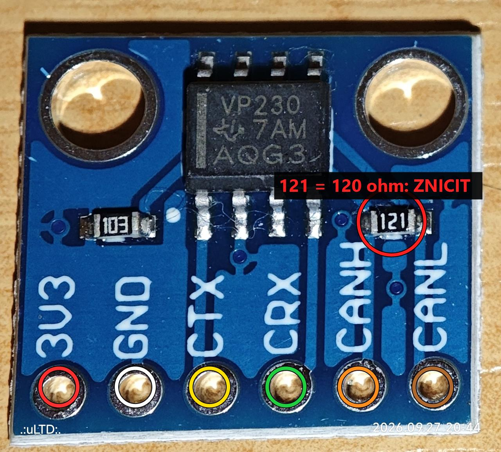
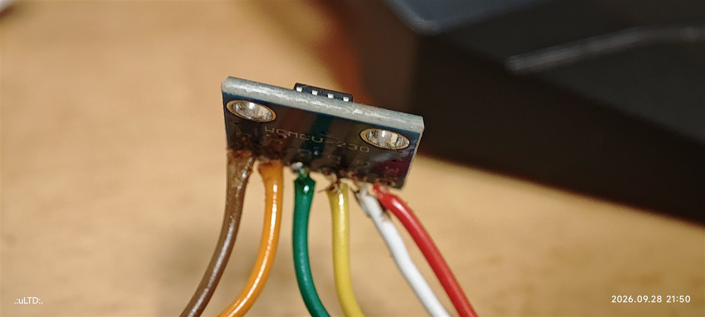
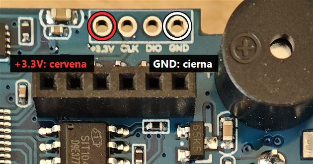
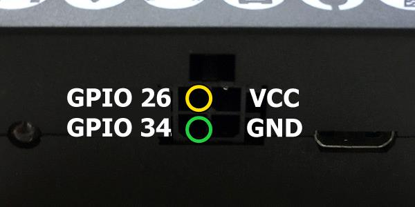
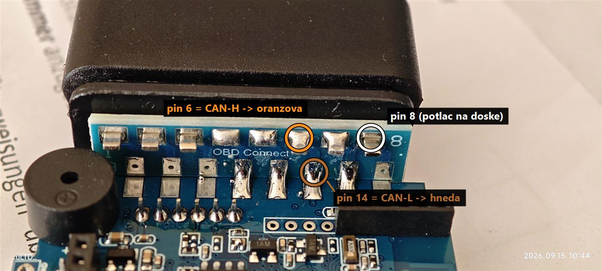

# Real odometer on the Freematics ONE+ via an external CAN transceiver

The Freematics ONE+ talks to the car only through its OBD co-processor
(a closed "OBD2USART" firmware on the STM32/APM32), which cannot send UDS
requests to a non-default CAN ID. On a VW Passat B8 the odometer is only
available as a UDS read from the **Gateway**, so the co-processor can never
get it. This modification adds a second CAN transceiver wired straight to the
ESP32's own CAN controller (TWAI), in parallel to the co-processor, which
keeps working unchanged.

Verified on device ZKUCA42T in a VW Passat B8 (2016, 1.6 TDI) on
2026-09-28: odometer **157 638 km read by the box = dashboard**.

> The photo labels are in Slovak: *cervena* = red, *cierna* = black,
> *oranzova* = orange, *hneda* = brown, *potlac na doske* = printed on the board.

## Parts

| Part | Notes |
|---|---|
| WCMCU-230 module (TI SN65HVD230, marked VP230) | 3.3 V only, no regulator on the board |
| 6 wires | colours below; CANH/CANL kept short and twisted together |

## Wiring

| Wire | Module pin | Freematics ONE+ | Verified |
|---|---|---|---|
| red | 3V3 | internal header **+3.3V** | measured 3.298 V |
| white | GND | internal header **GND** | |
| yellow | CTX | **GPIO26** (Molex, top left, seen from the front) | 3.3 V idle |
| green | CRX | **GPIO34** (Molex, bottom left) | 3.3 V idle |
| orange | CANH | OBD board **pin 6** | beeped against the OBD plug |
| brown | CANL | OBD board **pin 14** | beeped against the OBD plug |

Do **not** use the Molex VCC pin for the module: it carries 5 V
(measured 4.97 V, switched by GPIO12).

### 1. Module: remove the 120 Ω terminator

The car already terminates its bus. Break resistor **121** (120 Ω, red circle);
leave **103**. Check: CANH to CANL must no longer read ~120 Ω (ours read in the
kΩ range rising to OL / ~74 kΩ afterwards).



The finished module from the back (so the order is mirrored):
brown CANL, orange CANH, green CRX, yellow CTX, white GND, red 3V3.



### 2. Power: internal header on the main board

Top edge of the main board, above the black 6-pin socket and the SIT1040 chip:
**+3.3V** is the leftmost hole, **GND** the rightmost. Leave CLK and DIO free.
(The photo labels GND as black; in this build the GND wire is white.)



### 3. Signals: Molex GPIO pins

Front of the box (logo up, micro-USB on the right). Yellow CTX to **GPIO26**,
green CRX to **GPIO34**. Pin identity was measured with a test firmware
(GPIO26 toggled 0.12 V ↔ 3.2 V).



### 4. CAN: OBD Connect board

Pin 6 is the top row, 3rd pad from the right (the rightmost pad is printed
"8"); pin 14 is below it in the bottom row. Beep each pad against the pin of
the OBD plug before soldering.



### 5. Before power-on

- red ↔ white: no short;
- yellow and green: no short to ground;
- orange ↔ brown: not ~120 Ω.

## Mounting - lesson learned

The module does **not** fit inside the closed case together with the wires.
After squeezing it in, the box received **0 frames** on the next drive (the
day before, with the case open, it read the odometer fine): a CANH/CANL joint
had given way. Mount the module where nothing presses on it, keep CANH/CANL
short and twisted, and test with the case **open** in the car first, then again
after closing it (see "Checking" below).

## Firmware

[`canodo.cpp`](../../canodo.cpp) / [`canodo.h`](../../canodo.h) in `firmware_v5/telelogger/`, used by `telelogger.ino`:

- TWAI at 500 kbit/s on GPIO26 (TX) / GPIO34 (RX), every frame sent
  **single-shot** (never retransmitted).
- UDS `22 02 BD` to the Gateway **0x710**, reply from **0x77A** (multi-frame
  ISO-TP, flow control sent by the box). Odometer = data bytes 1..3,
  big-endian, km (e.g. `62 02 BD D6 02 67 C6 …` → 0x0267C6 = 157 638).
  Addresses/DID from a VCDS session captured with HexSniff; the same request
  was confirmed with an OVMS module in the same car.
- Read at every engine START and STOP record, then once a minute while the
  engine runs; **nothing is sent to the car while the engine is off**.
- Sent to the server as PID `0x1A6` = km (the Traccar Freematics decoder turns
  it into `odometer` in metres).
- Fuel (`22 22 B0` to the instrument cluster 0x714 → 0x77E) is read too but
  where the litres sit in the reply is **not confirmed** yet - sent raw as PIDs
  `0x391` (candidate, 0.1 l) and `0x392` (bytes).
- The external-GNSS probe (`gpsBeginExt()`) was removed: it claimed GPIO26/34
  as a UART at boot and on every GNSS reset.

## Checking

At boot the serial log shows the controller and a wiring check (CRX mirrors
the bus; 20/20 = bus free, 0/20 = something holds the bus or CRX/3V3 is open):

```
[CAN] ready (err=0x0)
[CAN] CRX high 20/20
```

Every read attempt sends a diagnosis with the next record when it fails or an
error counter moves (Traccar attributes `io902`…`io912`):

| PID | Traccar | Meaning |
|---|---|---|
| 0x386 | io902 | result: 0 OK, 3 no reply, 4 refused (NRC), 5 multi-frame timeout, … (`CanOdoResult` in `canodo.h`) |
| 0x387 | io903 | ECU negative response code |
| 0x388 | io904 | controller state (1 = running) |
| 0x389 | io905 | frames received since boot (any ID) |
| 0x38A | io906 | frames from the Gateway 0x77A |
| 0x38B / 0x38C | io907 / io908 | TX / RX error counters |
| 0x38D / 0x38E | io909 / io910 | bus errors / failed transmissions since boot |
| 0x38F | io911 | the ECU's reply bytes |
| 0x390 | io912 | ID of the last frame received |

How to read it in the car: **frames = 0** means the module receives nothing
from the bus (CANH/CANL, 3V3 or CRX) - on the OBD port the box's own
co-processor queries the engine all the time, so a connected module always
sees frames. Frames arriving but no reply from 0x77A points at the request
(CTX) or the addressing.
